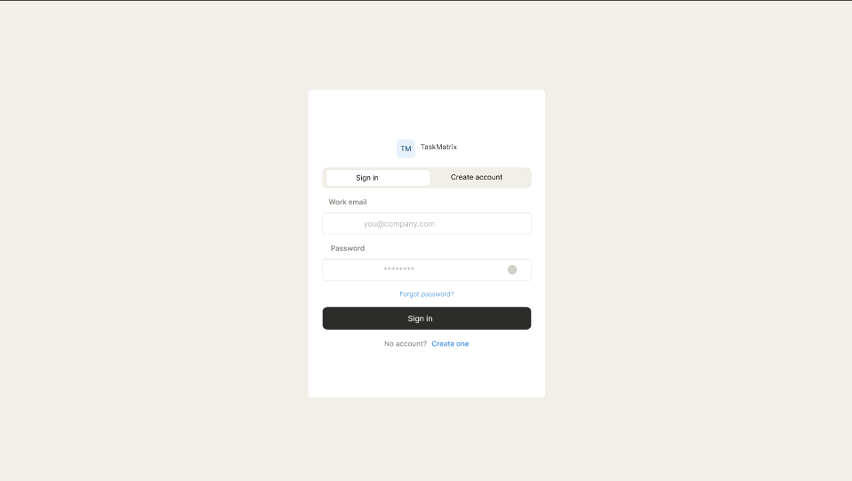
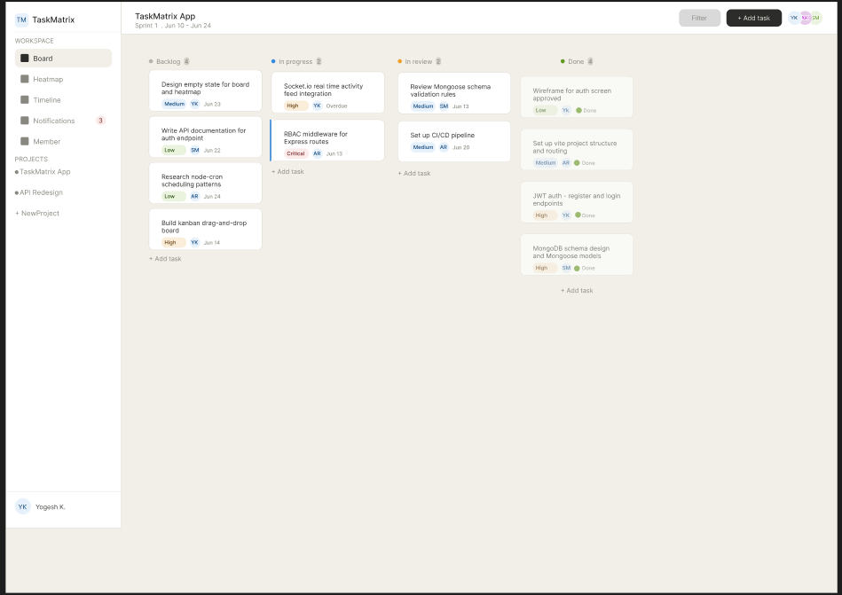
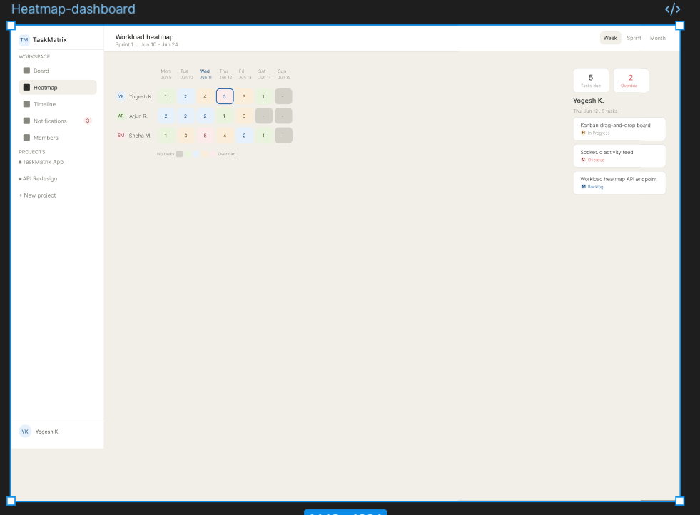
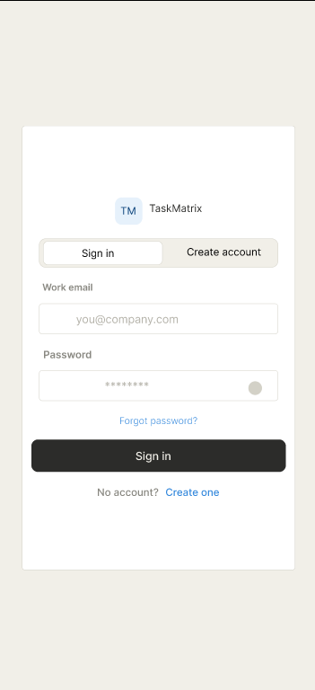
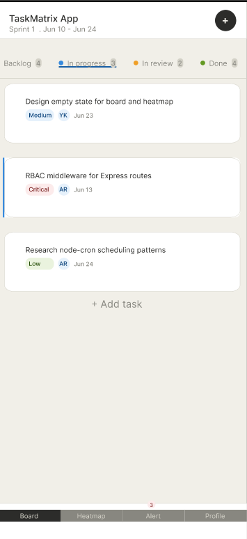
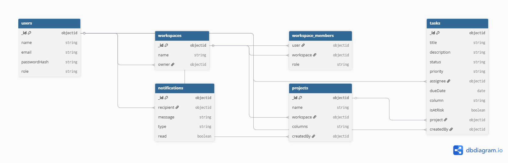

# TaskMatrix 🗂️

> A real-time, collaborative project management tool engineered for small software teams — built with a focus on live board updates, intelligent workload visibility, and a clean, distraction-free UX.

---

## 📌 Project Overview

**TaskMatrix** is a full-stack Agile project management application inspired by Jira and Asana, but purpose-built for small engineering teams (2–8 members) who need speed and clarity over enterprise complexity.

The application features a live drag-and-drop Kanban board, real-time activity feeds powered by WebSockets, role-based access control, deadline automation via cron jobs, and a **Workload Heatmap** — a visual, calendar-based dashboard that surfaces team member overload at a glance, making sprint planning decisions faster and more informed.

---

## 🎯 Designated Track

**Fullstack** — React frontend deployed on Vercel, Express + Node.js backend deployed on Render, MongoDB Atlas as the primary database.

---

## 🛠️ Tech Stack

### Frontend
| Technology | Purpose |
|---|---|
| React 18 + Vite | UI framework and dev tooling |
| React Router v6 | Client-side routing |
| Socket.io Client | Real-time board sync and activity feed |
| @dnd-kit/core | Drag-and-drop Kanban board |
| Axios | HTTP client for REST API calls |
| date-fns | Date formatting and deadline calculations |

### Backend
| Technology | Purpose |
|---|---|
| Node.js + Express | REST API server |
| Socket.io | Real-time bidirectional event layer |
| MongoDB Atlas | Primary database |
| Mongoose | ODM and schema validation |
| JSON Web Tokens (JWT) | Stateless authentication |
| bcryptjs | Password hashing |
| node-cron | Scheduled deadline warning jobs |
| Cloudinary + Multer | File attachments on tasks |

### DevOps & Tooling
| Technology | Purpose |
|---|---|
| Vercel | Frontend deployment |
| Render | Backend deployment |
| MongoDB Atlas | Managed cloud database |
| dotenv | Environment variable management |
| Git + GitHub | Version control |

---

## ✨ Core Features (Prioritized)

### P0 — Mandatory (Sprint Core)

#### 1. Authentication & Role-Based Access Control
- JWT-based register/login flow with bcrypt password hashing, JWT stored in httpOnly cookie
- Two roles: **Admin** and **Member** (Viewer role deferred to P2 — see below)
- Role guards on both frontend routes and backend API endpoints
- Admin can invite members to a workspace, assign roles, and remove users
- Member can create tasks, move cards, and edit/delete only their own or assigned tasks

#### 2. Workspace & Project Management
- Users can create and manage multiple **Workspaces**
- Each workspace contains one or more **Projects**
- Projects contain a Kanban board with configurable columns (e.g. Backlog → In Progress → Review → Done)

#### 3. Drag-and-Drop Kanban Board
- Fully interactive board powered by `@dnd-kit`
- Tasks can be dragged between columns and reordered within a column
- Board state persisted to MongoDB on every drop event
- Optimistic UI updates — board feels instant before server confirmation

#### 4. Task Management (Full CRUD)
- Create, edit, and delete tasks with: title, description, assignee, priority tag (Low / Medium / High / Critical), due date, and file attachments
- Task detail modal with full edit capability
- Priority color-coding visible on Kanban cards

#### 5. Real-Time Activity Feed (Socket.io)
- All board events (task moved, created, assigned, commented) broadcast to all connected workspace members instantly
- Live typing indicators when a user is editing a task description
- No page refresh required — direct carry-over from Sprint 12

### P1 — Priority Features

#### 6. 🔥 Signature Feature: Workload Heatmap
- A calendar-grid view (week or month) showing each team member's assigned task load per day
- Cell color intensity maps to task count (light = low load, saturated = overloaded)
- Clicking a cell drills into that member's tasks for that day
- Designed to make sprint planning decisions visual and immediate — the standout feature of the application

#### 7. Deadline Cron Jobs & Smart Warnings
- `node-cron` job runs every hour on the backend
- Tasks approaching their deadline (within 24h) trigger an in-app notification badge
- Overdue tasks are automatically flagged with an `OVERDUE` status tag and surfaced in a dedicated "At Risk" sidebar panel

#### 8. Comments & Mentions
- Threaded comments on task detail view
- `@mention` a team member to trigger a notification
- Comment count badge visible on Kanban cards

### P2 — Advanced (Stretch Goals)

#### 9. AI-Assisted Task Breakdown
- Text input field on new task modal: "Describe a feature in plain English"
- Calls the Claude API to generate a structured list of subtasks
- Subtasks are pre-populated into the task form for the user to review and confirm

#### 10. Focus Mode
- A distraction-free single-task view that hides the board
- Shows only the active task, a Pomodoro-style timer, and a subtask checklist
- Keyboard shortcut to enter/exit (`F` key)

#### 11. Sprint Planning View
- Dedicated sprint creation flow: define sprint name, start date, end date
- Drag tasks from the Backlog into a sprint
- Velocity tracker showing estimated vs completed points per sprint

#### 12. Viewer Role
- Read-only third role — disables all write operations via a single middleware flag
- Useful for clients, stakeholders, or managers who need visibility without edit access

---

## 🗂️ Repository Structure (Planned)

```
prodesk-capstone-TaskMatrix/
├── client/                  # React + Vite frontend
│   ├── src/
│   │   ├── components/      # Reusable UI components
│   │   ├── pages/           # Route-level page components
│   │   ├── hooks/           # Custom React hooks (useSocket, useAuth, etc.)
│   │   ├── context/         # Auth and Socket context providers
│   │   ├── services/        # Axios API service layer
│   │   └── utils/           # Helpers (date formatting, priority colors, etc.)
│   └── vite.config.js
│
├── server/                  # Express + Node.js backend
│   ├── controllers/         # Route handler logic
│   ├── models/              # Mongoose schemas
│   ├── routes/              # Express route definitions
│   ├── middleware/          # Auth guard, error handler, role guard
│   ├── services/            # Business logic (socket events, cron jobs, Cloudinary)
│   └── index.js             # Server entry point
│
├── .env.example             # Environment variable template
├── .gitignore
└── README.md                # This file (PRD)
```

---

## 🎨 UI/UX Wireframes

Figma file (public): [TaskMatrix — Wireframes](https://www.figma.com/design/jtSOi7pQm2C6ee5cJAwWeW/prodesk-capstone-TaskMatrix?node-id=0-1&t=o86Ci2HJAgu9LxFp-1)

### Desktop

| Screen | Preview |
|---|---|
| Auth — Sign in / Create account |  |
| Kanban Board — main dashboard |  |
| Workload Heatmap — signature feature |  |

### Mobile

| Screen | Preview |
|---|---|
| Auth — Mobile |  |
| Kanban Board — Mobile |  |

### Responsive considerations

On mobile, the left sidebar collapses into a bottom navigation bar (Board, Heatmap, Alerts, Profile). The four Kanban columns become a horizontally scrollable tab strip — each tab retains its status dot, label, and task count, with the active column underlined. The topbar's "Add task" button becomes a circular floating action button for easier thumb access. The Auth screen requires no structural changes — the card simply becomes the full viewport width.

---

## 🗺️ Entity Relationship Diagram

A User belongs to multiple Workspaces through WorkspaceMember (which carries the role). A Workspace contains multiple Projects, and each Project contains multiple Tasks. Each Task references an assignee and a createdBy user, plus the project it belongs to. Notifications reference a single recipient. This structure directly supports the RBAC model — `WorkspaceMember.role` is what backend middleware checks to determine Admin vs Member permissions per workspace.



---

## 🗃️ Data Models (High-Level)

| Model | Key Fields |
|---|---|
| `User` | name, email, passwordHash, role, workspaces[] |
| `Workspace` | name, owner, members[], projects[] |
| `WorkspaceMember` | user (ref), workspace (ref), role |
| `Project` | name, workspace, columns[], createdBy |
| `Task` | title, description, status, priority, assignee, dueDate, isAtRisk, attachments[], comments[], column |
| `Comment` | body, author, task, createdAt |
| `Notification` | recipient, message, type, read, createdAt |

---

## 🚀 Deployment

| Layer | Platform | URL |
|---|---|---|
| Frontend | Vercel | TBD post-deployment |
| Backend | Render | TBD post-deployment |
| Database | MongoDB Atlas | Cloud-hosted cluster |
| Media Storage | Cloudinary | CDN-hosted file attachments |

---

## 📋 Development Phases

| Week | Focus |
|---|---|
| Week 1 (current) | Blueprint — PRD, system architecture, UI/UX wireframes |
| Week 2 | Auth, RBAC, Workspace + Project CRUD, Kanban board (P0) |
| Week 3 | Real-time Socket.io layer, Activity Feed, Task comments |
| Week 4 | Workload Heatmap, Deadline cron jobs, Notifications |
| Week 5 | AI task breakdown (P2), polish, deployment, demo prep |

---

## 👤 Author

**Yogesh Kashyap** · [@yogesh2002kashyap](https://github.com/yogesh2002kashyap)

> Capstone project — Sprint 13 · Fullstack Track